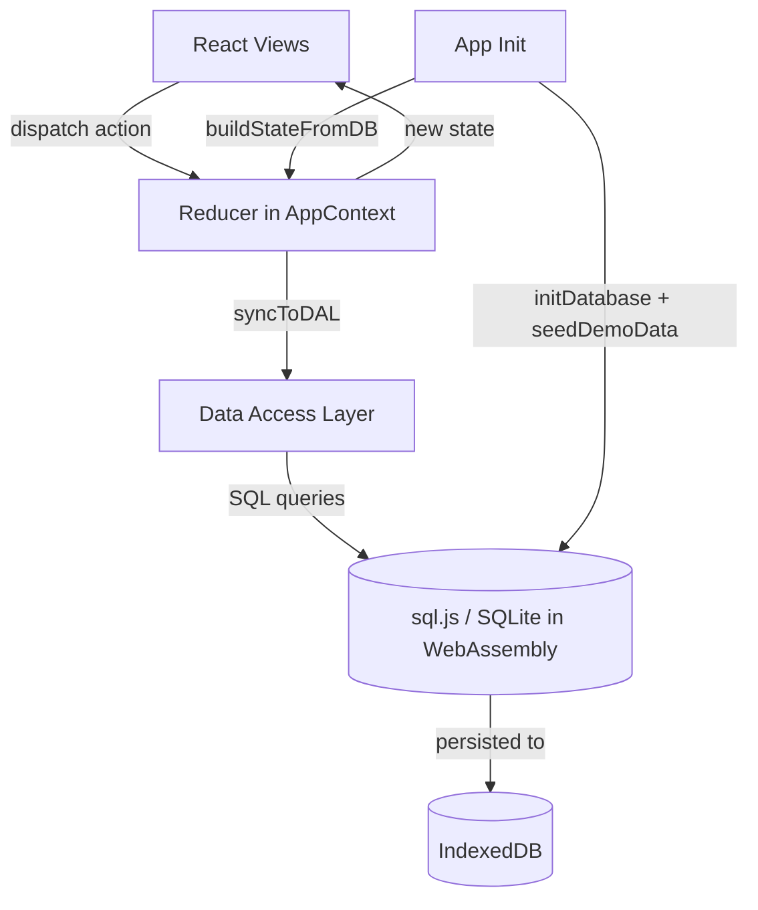
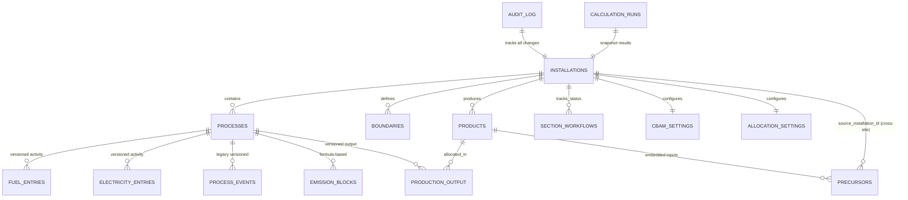
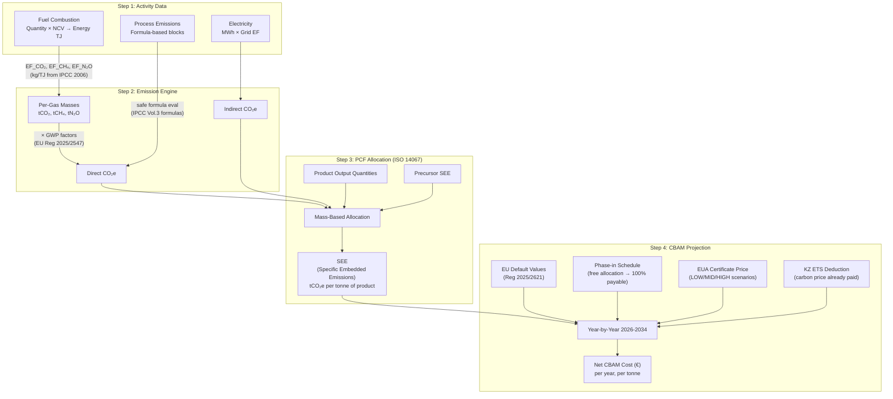

# Carbon Ledger MRV — Project Handoff

---

## 1. Hypothesis & What the MVP Tests

### The Problem
When companies import CBAM-covered goods (steel, cement, aluminium, fertilisers, hydrogen, electricity) into the EU, they must:
1. **Report** the greenhouse gas emissions *embedded in each product* (the Product Carbon Footprint, or PCF) to EU authorities.
2. **Purchase CBAM certificates** to cover those emissions, with the cost linked to the EU ETS carbon price.

This is not a corporate carbon footprint. It is a *product-level* footprint tied to a specific CN code — governed by strict calculation rules set out in the CBAM Regulation and its implementing acts.

### The Hypothesis
> *Exporters and importers have a critical need to digitize the end-to-end process of Product Carbon Footprint (PCF) calculation and CBAM reporting. A successful solution must provide a traceable, auditable process that simplifies these complex calculations while ensuring compliance with EU regulations.*

The current local-first, client-side SQLite architecture is simply a technical vehicle to rapidly build and validate this core value proposition with a privacy-first user experience.

### What the MVP Validates
- **Can we fully digitalise the CBAM calculation pipeline for real-world scenarios?** We are validating if the tool can handle the complex reporting needs of specific industries (currently tested with Primary Aluminium and Integrated Steel BF-BOF route).
- **Does the tool provide sufficient traceability and auditability?** We are validating if the versioned data records, calculation lineage, and QA dashboards give users (and eventually auditors) the confidence required for compliance reporting.
- **Can a digital tool simplify the use of EU default values?** We are validating if embedding 10,932 official EU default emission values (with automatic CN code fallback matching) reduces the friction of CBAM cost projections.

### What Would Invalidate the Hypothesis
- If users find that the digital process is no more efficient or trustable than their existing spreadsheet-based workflows.
- If the required level of traceability (e.g., cross-installation precursor tracking) proves too complex to model accurately for the average user without bespoke consulting.

---

## 2. Technical Architecture

### 2.1 Tech Stack

| Layer | Technology | Role |
|-------|-----------|------|
| UI Framework | React 19, Vite 7 | SPA with tab-based navigation |
| Styling | Tailwind CSS 4 | Utility-first design system |
| Charts | Recharts | Emission breakdown & projection charts |
| Database | sql.js (SQLite → Wasm) | Full relational DB in-browser, persisted to IndexedDB |
| Animations | Framer Motion | Page transitions, toast notifications |
| Icons | Lucide React | Consistent iconography |
| i18n | Custom `LanguageContext` | English, Russian, Kazakh |
| Deployment | GitHub Pages via Actions | Static hosting, zero backend |

### 2.2 Application Structure

```
src/
├── App.jsx                    # Root component — sidebar + tab routing
├── components/                # Reusable UI (Sidebar, LineagePanel, SectionWorkflow*)
├── context/
│   ├── AppContext.jsx         # Global state — reducer + syncToDAL middleware (~1000 lines)
│   └── LanguageContext.jsx    # i18n provider
├── data/                      # Static reference datasets
│   ├── referenceData.js       # Fuel types, CN codes, grid EFs (IPCC/IEA sources)
│   ├── cbamReferenceData.js   # Phase-in schedule, cert prices, KZ ETS, markup rules
│   ├── cbamDefaultValues.js   # 10,932 country×CN default emission values (3.2MB)
│   ├── processTemplates.js    # Sector-specific formula library (12 templates)
│   └── demoScenario.js        # BF-BOF steel demo seed data
├── db/
│   ├── schema.sql             # 15 tables — versioned records + audit trail
│   ├── database.js            # sql.js init, persist to IndexedDB
│   ├── dal.js                 # Data access layer — all CRUD operations (~27KB)
│   └── seed.js                # Demo data seeder
├── engine/
│   ├── emissionEngine.js      # Multi-gas calculation + PCF allocation
│   ├── cbamCalculator.js      # 2026-2034 projection with phase-in + KZ ETS deductions
│   ├── cbamExporter.js        # CBAM communication template (JSON/CSV)
│   ├── formulaEvaluator.js    # Safe math expression parser (no eval())
│   └── qaEngine.js            # Data completeness checker
├── views/                     # 12 tab-level page components
│   ├── DashboardView.jsx      # Snapshot overview, quick actions
│   ├── BoundariesView.jsx     # Installation boundaries + OpenStreetMap
│   ├── ActivityView.jsx       # Fuel + electricity data entry
│   ├── EmissionBlockPanel.jsx # Process emission formula builder
│   ├── AllocationView.jsx     # Product definition, precursors, PCF
│   ├── ResultsView.jsx        # CBAM projection + scenario analysis
│   ├── QADashboardView.jsx    # Automated data quality checks
│   ├── AuditTrailView.jsx     # Change history with diffs
│   ├── ExportView.jsx         # CBAM communication template export
│   ├── ReportView.jsx         # Printable HTML report
│   └── SettingsView.jsx       # CBAM settings + allocation method config
```

### 2.3 State Management Architecture



The state management follows a **dual-write** pattern:
1. The React reducer updates in-memory state for immediate UI reactivity.
2. A `syncToDAL()` middleware synchronously writes the same mutation to SQLite.
3. On app load, `buildStateFromDB()` reconstructs the full React state from SQL, ensuring the DB is the source of truth.

### 2.4 Database Schema



**Key design decisions:**
- **Versioned records:** `fuel_entries`, `electricity_entries`, `process_events`, and `production_output` all use a `stable_id` + `version_number` pattern with `supersedes_version_id` for full traceability.
- **Cross-installation precursors:** The `precursors` table has `source_installation_id` and `source_product_id` fields, enabling linked SEE values across installations.
- **Verification workflow:** `section_workflows` tracks per-section status (DRAFT → SUBMITTED → APPROVED → LOCKED) independently, while the installation-level `workflow_status` governs the overall lifecycle.

---

## 3. Calculation Methodology & Regulatory References

### 3.1 Regulatory Framework

| Reference | What It Governs | Where Used in Code |
|-----------|----------------|--------------------|
| **EU Reg. 2023/956** (CBAM Regulation) | Covered goods, CN codes in Annex I, reporting obligations | `referenceData.js` — `CBAM_CN_CODES` |
| **EU Reg. 2025/2621** | Default emission values by country and CN code, markup schedule | `cbamDefaultValues.js`, `cbamReferenceData.js` — `MARKUP_SCHEDULE`, `KZ_DEFAULT_VALUES` |
| **EU Reg. 2025/2547**, Annex II, Table 6 | GWP factors for CBAM (CO₂=1, CH₄=29.8, N₂O=265, CF₄=6630, C₂F₆=11100) | `emissionEngine.js` — `GWP_AR6` |
| **IPCC 2006 Guidelines**, Vol. 2, Ch. 2 | Fuel emission factors (kg/TJ), Net Calorific Values (GJ/t) | `emissionEngine.js` — `DEFAULT_EMISSION_FACTORS`, `referenceData.js` — `FUEL_TYPES` |
| **IPCC 2006 Guidelines**, Vol. 3, Ch. 2-4 | Process emission formulas (calcination, anode, PFC, reducing agents) | `processTemplates.js` — `PROCESS_TEMPLATES` |
| **IEA 2023** | Country-specific grid emission factors (tCO₂/MWh) | `referenceData.js` — `GRID_EF_BY_COUNTRY` |
| **ISO 14067** | Product carbon footprint principles — mass-based allocation approach | `emissionEngine.js` — `calculatePCF()` |
| **GHG Protocol** (Scope 1/2/3 framework) | Classification of direct vs. indirect emissions | Boundary `scopeTag` field; emission aggregation in `calculateTotalEmissions()` |

### 3.2 The Calculation Pipeline



### 3.3 Key Formulas

**Combustion Emissions (per fuel entry):**
```
Energy_TJ      = Quantity(t) × NCV(GJ/t) / 1000
CO₂(t)         = Energy_TJ × EF_CO₂(kg/TJ) / 1000
CH₄(t)         = Energy_TJ × EF_CH₄(kg/TJ) / 1000
N₂O(t)         = Energy_TJ × EF_N₂O(kg/TJ) / 1000
CO₂e(t)        = CO₂ × 1 + CH₄ × 29.8 + N₂O × 265
```

**PCF / Specific Embedded Emissions:**
```
Product_Share   = Product_Quantity / Total_Non-Residue_Output
Allocated_CO₂e  = Total_Installation_CO₂e × Product_Share
SEE             = Allocated_CO₂e / Product_Quantity    (tCO₂e per t product)
```

**CBAM Net Cost (per year):**
```
Embedded_CO₂    = Import_Qty(t) × SEE(tCO₂e/t)
Payable_CO₂     = Embedded_CO₂ × Phase_In_Share(year)
Gross_Cost(€)   = Payable_CO₂ × EUA_Cert_Price(€/tCO₂)
KZ_Deduction(€) = MIN(Cert_Price, KZ_ETS_Price) × Embedded_CO₂ × KZ_Quota_Share
Net_Cost(€)     = MAX(0, Gross_Cost − KZ_Deduction)
```

### 3.4 Process Emission Templates

The app includes 12 predefined sector-specific formula templates (from IPCC 2006 Vol.3):

| Sector | Templates | Example Formula |
|--------|----------|-----------------|
| **Aluminium** | Anode CO₂, PFC-CF₄, PFC-C₂F₆ | `production × anode_rate / 1000 × (C − S − ash) × 44/12` |
| **Cement** | Calcination, MgO decomposition, CKD | `clinker × CaO_ratio × 44/56` |
| **Iron & Steel** | Reducing agent, limestone flux, electrode | `agent_mass × carbon_content × 44/12` |
| **Fertilisers** | N₂O from nitric acid, CO₂ from urea | `HNO₃_prod × EF / 1000 × (1 − destruction)` |
| **Hydrogen** | SMR CO₂ | `feedstock × carbon_content × 44/12` |
| **Custom** | Blank template | User-defined |

---

## 4. Future Evolution

### If the Hypothesis is Validated ✅
The local-first approach works → scale the product:

1. **Multi-tenant backend migration:**
   - Move from client-side SQLite to a hosted PostgreSQL/Supabase backend with user authentication and role-based access.
   - Cross-installation precursor SEE sharing becomes a first-class feature with a proper API.
   
2. **Official export format conformity:**
   - Implement XML export matching the EU's actual CBAM communication template schema.
   - Add XLSX export using the official EC template structure.
   
3. **Expand sector coverage:**
   - Add process templates for remaining CBAM sectors (electricity generation, glass, ceramics).
   - Support production route variants (e.g., DRI/EAF vs BF/BOF for steel).
   
4. **Supply chain integration:**
   - Allow importers to link to supplier installations and pull verified SEE data.
   - Build an importer-facing dashboard (vs. the current installation-operator view).

5. **Regulatory updates:**
   - As the EU publishes updated default values or changes the CBAM scope, regenerate defaults via `parse_cbam_defaults.cjs` and update reference data accordingly.

### If the Hypothesis is Invalidated ❌
The browser-only model hits a wall → pivot the architecture:

1. **Data scale:** If `cbamDefaultValues.js` (currently 3.2MB) grows too large for browser memory, move to server-side lookup.
2. **Multi-user:** If real-world usage requires concurrent editing or shared installations, the single-player SQLite model must be replaced.
3. **Regulatory complexity:** If export formats require server-side PDF/XML generation or digital signatures, add a lightweight API layer.

### Immediate Technical Debt (Regardless of Pivot)
These are code-quality improvements that are valuable in either direction:

1. **Split `AppContext.jsx`** (~1000 lines) into domain-specific contexts (`ActivityContext`, `AllocationContext`, `SettingsContext`).
2. **Modularize `dal.js`** (~27KB) into per-domain repository files.
3. **Decompose large views** — especially `AllocationView.jsx` (35KB) and `EmissionBlockPanel.jsx` (44KB) — into smaller, testable components.
